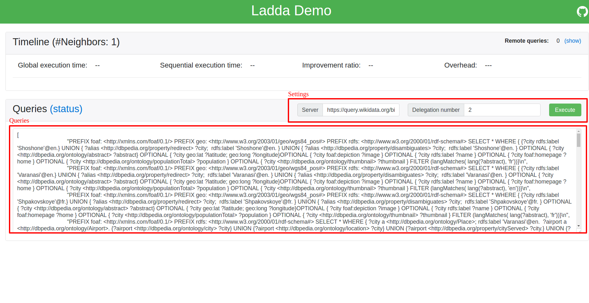
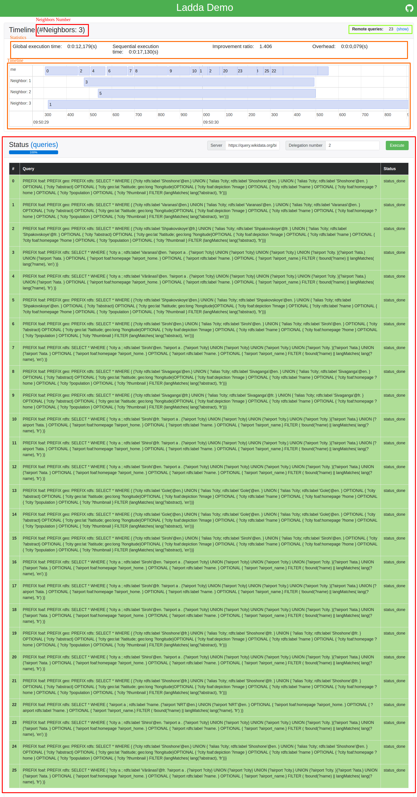

# ladda-demo (Query Delegation)  

Orignal Interface code is available here : https://github.com/ErrOrnAmE/LaddaFogletDemo

Ladda Delegation Protocol Implementation is available here : [foglet-ndp](https://github.com/folkvir/foglet-ndp)

## Acknowledgement

We thank

* Thibaud Courtoison,
*  Maël Quémard,
* Sylvain Vuylsteke,

students of the Computer Science Department at the University of Nantes for implementing the interface of the SPARQL foglet.

## Use

Firstly, note there are 2 main parts in the interface, The Timeline section, and the Queries section.



If you just want to execute the example workload, so just click on the button **Execute** and refer to the *Run part*.

### Settings

But if you want to execute your own workload of queries, you have to provide 3 things,

Firstly (first red section):
* The **Server url** (Triple Pattern Fragment Server)
* The **Delegation Number** A value between 0 or K (The size of the network) ```[0...K]```

Secondly (second red section):
* Your own **workload** as an array of strings ``` ['query1', 'query2', ..., 'queryN'] ```

### Run

Once you clicked on the **Execute** button, another panel appeared and you can follow the execution in real-time with the **status** of all queries.

The panel with all queries follows a color coding style:
* White, the query is awaiting execution or delegation
* Green, the query has been successfully executed
* Orange, the query was delegated to a neighbor and the client is waiting for the response
* Red, the query delegation has failed

The timeline allows you to know in real-time when a participant (a neighbor) executes a query. Each line represents a neighbor, **me** represents you.

**Remote queries** link can show you a list of all queries delegated to us. It follows a color style: red; the delegation failed, green; delegation succeeded.

### Statistics

There are 4 stats computed:
* Global execution time
* Sequential execution time (Approximation relative to the global execution)
* Improvement ratio (Global to Sequential)
* Overhead (Communication)


